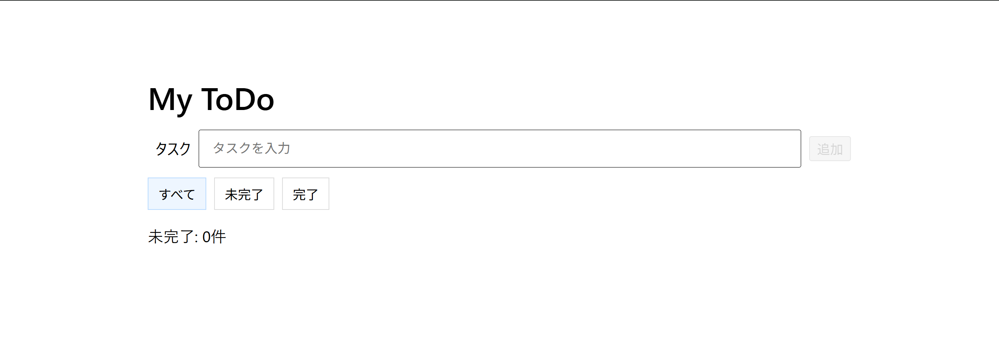
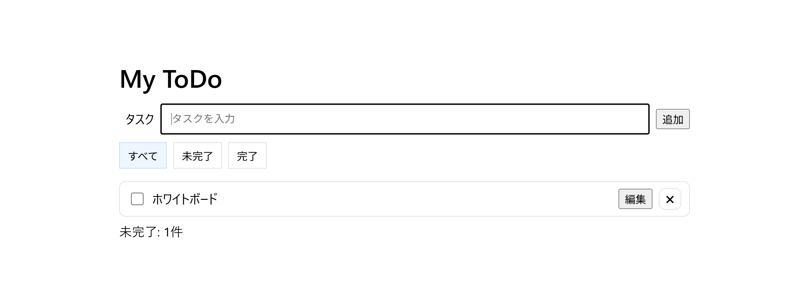
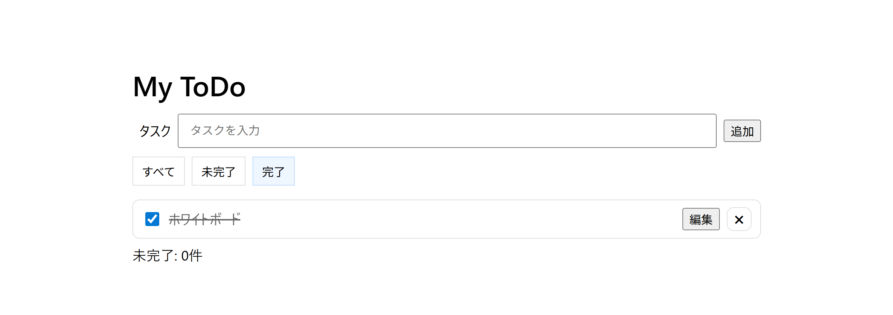

# Todo App

シンプルでアクセシブルなToDoアプリ。  
**デモ:** https://aimu911563-eng.github.io/todo-app/

## 機能
- タスクの追加 / 編集 / 削除 / 完了切替
- フィルタ（all / active / done）
- 入力バリデーション（空白のみを禁止）
- 未完了カウント表示
- localStorage による保存・復元
- アクセシビリティ（aria-pressed、操作ボタンに aria-label 等）

## 使い方（開発）
```bash
git clone https://github.com/aimu911563-eng/todo-app.git
cd todo-app
# ローカルで index.html を開くだけで動作

# ToDo App
- Demo: https://aimu911563-eng.github.io/todo-app/
- Features: Add/Delete, Persist with localStorage, Done toggle, Filter (all/active/done)
2025-09-06 レビュー修正
## Features
- Add / Delete tasks
- Persist with localStorage
- Toggle done / undone
- Filter by status (all / active / done)
- Edit task text inline
- Show count of remaining (active) tasks
- Highlight task while editing
- Prevent adding empty/whitespace-only tasks
- Disable "Add" button when input is empty
- Improved accessibility (filter buttons with aria-pressed)
## 画面イメージ

- トップ画面  
  

- タスク追加・編集・削除  
  

- フィルタ切替  
  
